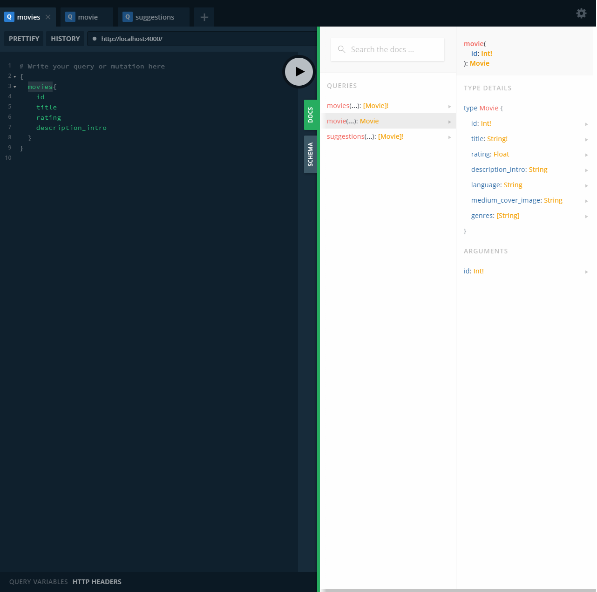
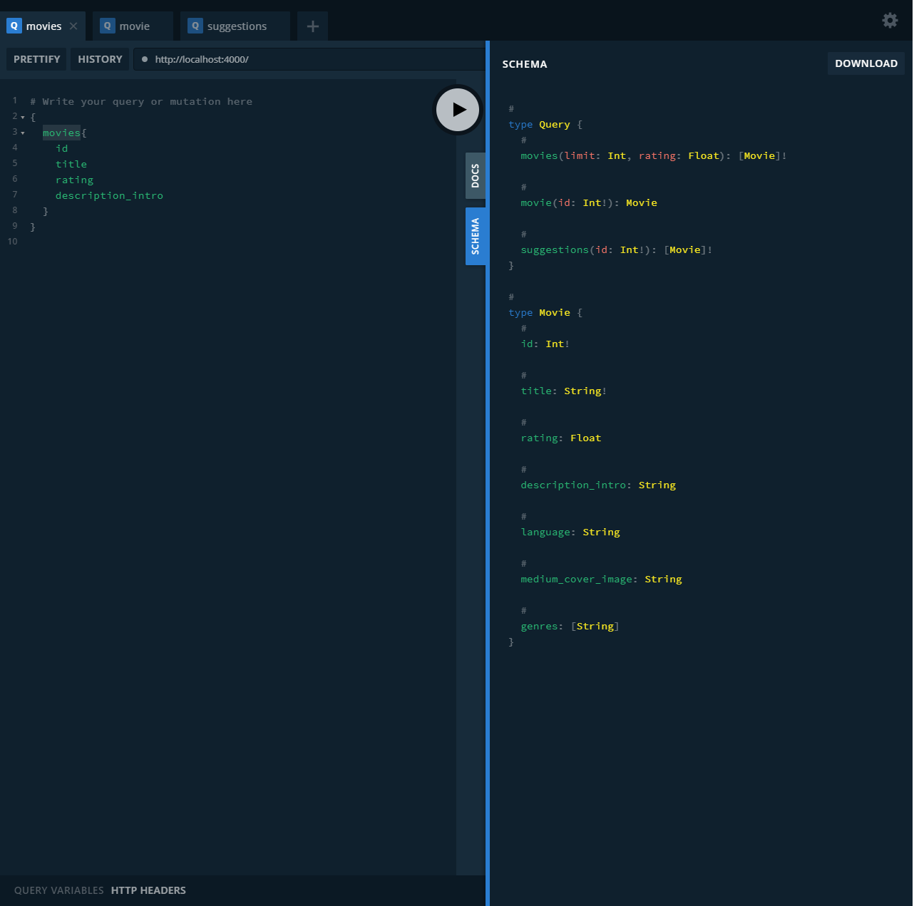
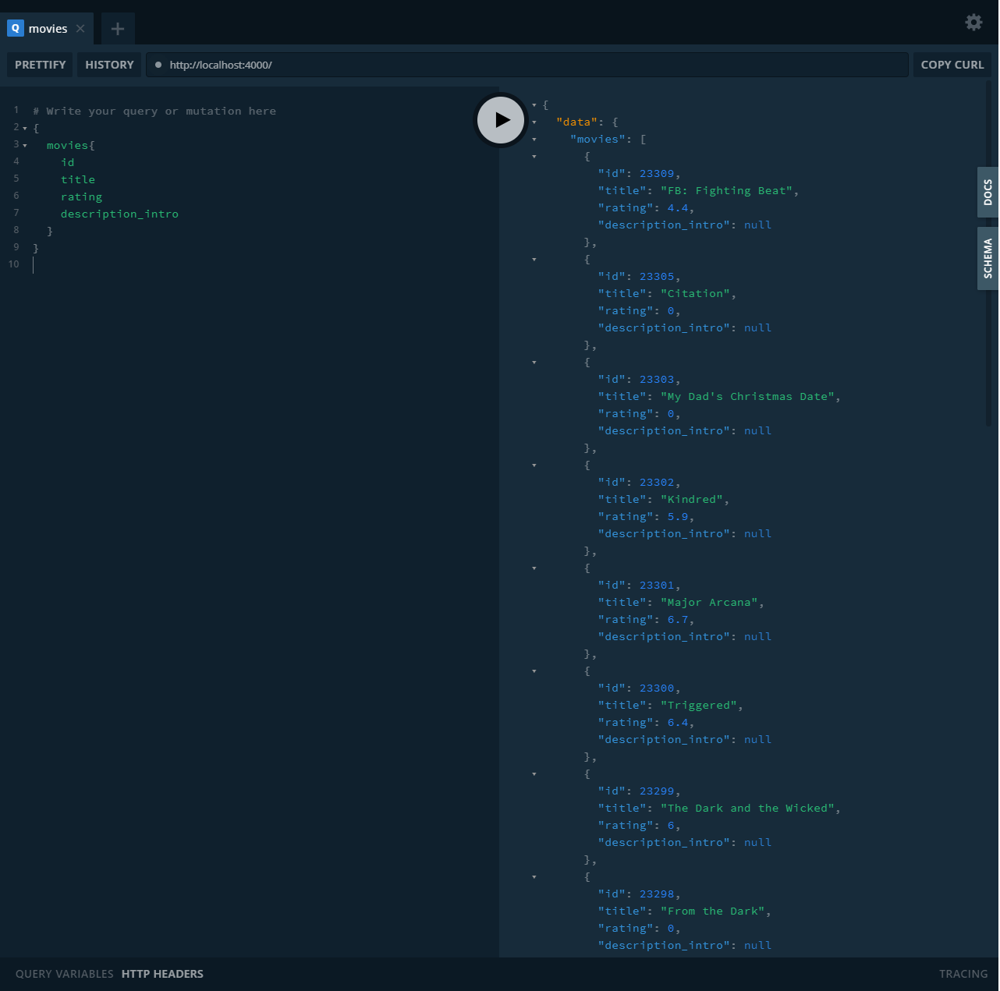
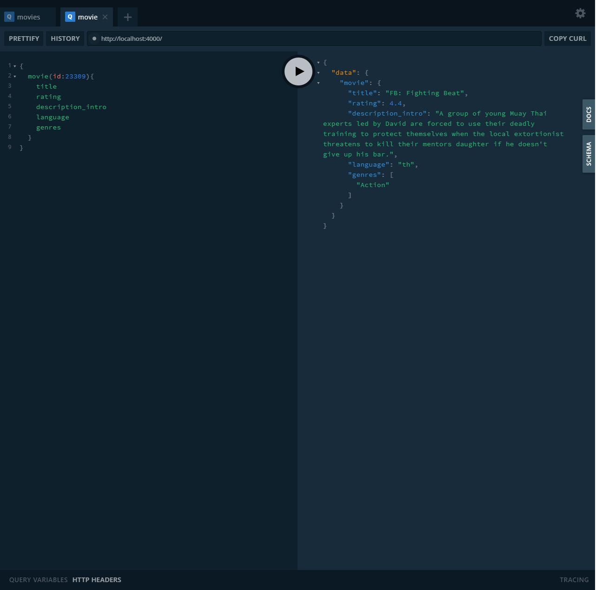
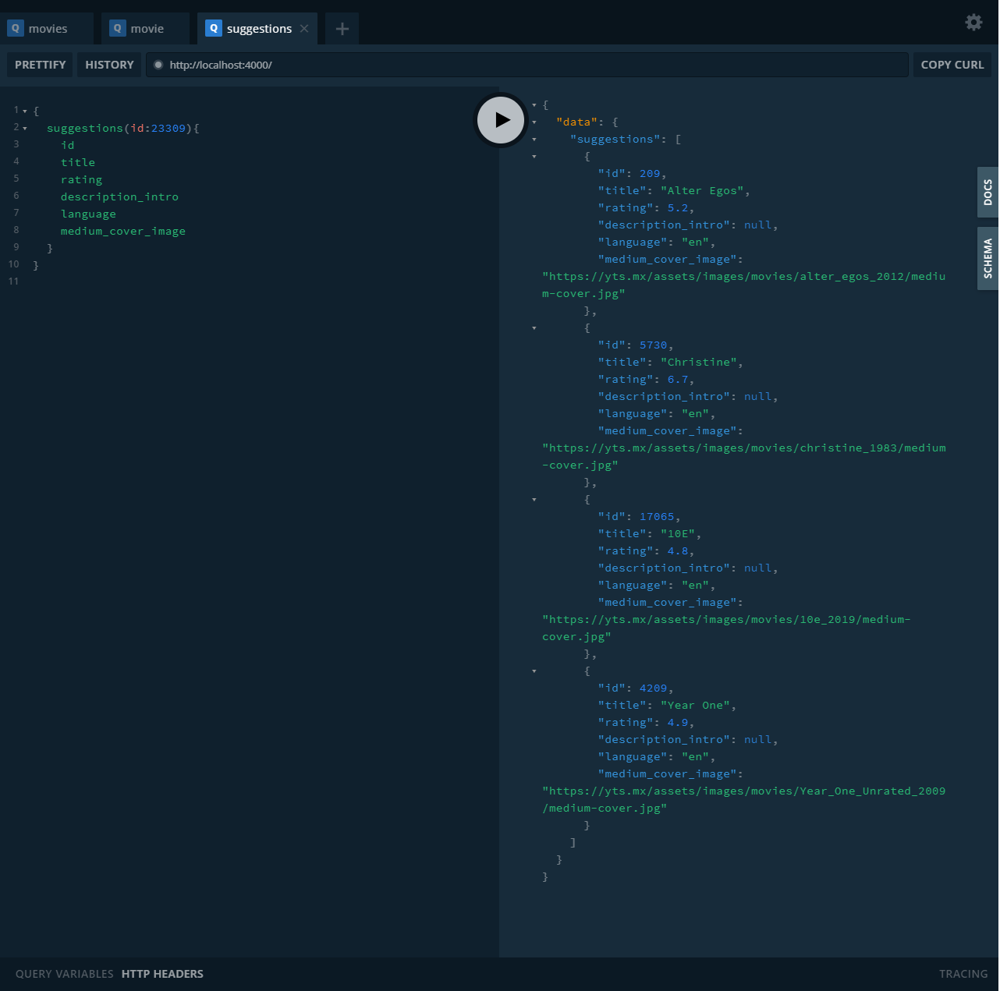

# GraphQL Movie APi Backend

> Graphql과 yts API를 사용하여 movie data를 가져옴 (movie server 구현) 
> graphql-yoga 설치방법 학습 
> nodemon 사용방법 학습 
> .barbelrc 파일 작성방법 학습 
> axios의 사용방법을 학습 
> resolvers와 schema의 개념을 잡음 
> GraphQL-Movie-APi-Font랑 연결 

### 구현 동작

